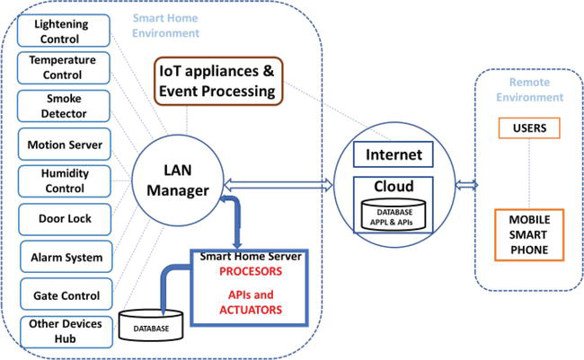

# Web of Things Platform (WeT) - Overview

# LightWaveRF Smart Home Automation based on Internet of Things

LightWaveRF WiFi link communication for command line home automation, Google Calendar timing of your electrics or energy monitoring to manage the amazing Smart Home Platform with your Android smartphone or tablet. A ruby gem for LightWaveRF home automation. Interact with LightWaveRF WiFi link from code or the command line. 


Remote control:
* 220V light bulbs (turning the utility lights ON/OFF - outdoor lighting)
* color changeable LED RGB (light effects, brightness, luminance and color)
* power sockets & adaptors
* heating thermostat (temperature controllers)
* tap water
* air conditioner (adjusting the temperature, humidity and air quality)
* gas security (leak detection, electrovalve closed)
* doors and gates lockers (access control) 
* video camera (security and surveillance cameras)
* alarm systems (safety detectors, move detection, presence simulation, notification)
* fire & smoke sensor
* electric roller blinds and curtains
* auto open/close window
* TV
* radio
* computer (desktop PC / laptop)
* monitor displays & screen
* projector
* sound speaker

Devices controller (peripherals / modules) you will want to purchase: 
* dimmers, switches, outlets, sensors & timers
* lighting & appliance remote controls
* smart plumbing & irrigation

Also set up timers using a Google Calendar and log energy usage.

# What does it do?
The script compares curent time with Google Calendar timing or today's sunrise and sunset times. If it's 30 min. before sunset or sunrise and script will detect your device, for example mobile phone logging in to WiFi AC, it will send a signal to LightWaveRF bridge to switch ON or OFF specific device.



# Setup
Get a LightWaveRF WiFi-link for remote iPhone or Android Mobile Phone lighting control http://amzn.to/V7yPPK and a remote socket - connected light switch, double dimmer wireless - iOS, iPhone and Android Smart Home automation control http://amzn.to/RkukDo

## Install gem

Then this code is available as a gem, so:

    gem install lightwaverf

No need to do anything with this repo unless you are particularly interested.

[](http://badge.fury.io/rb/lightwaverf)

This code is unofficial and unaffiliated with http://www.lightwaverf.com

## Setup config

You need a config file in your home directory, to build one

    lightwaverf configure

Or if you have already uploaded your data to the LightWaveRF server, download this data by typing

    lightwaverf update 

## Device pairing

Then "pair" your code with your device as normal, put it in pairing mode then turn the device on with the code, with commands like

    lightwaverf firmware

The first time you try to pair a device from the computer look out for the "pair with this device" message on the WiFi link LCD screen, and click the button to accept.

Note that if you are already using the iPhone/other app, then your device pairings may already be done. The wifilink is a single transmitter from the actual device's perspective - all clients (so your iPhone and PC running this ruby program) are the same thing.

## How to install on your raspberry pi
    sudo apt-get install ruby gem
    sudo gem install lightwaverf # or build the gem locally, see below
    lightwaverf configure
    lightwaverf firmware # possibly not required, but harmless
    lightwaverf dining lights on # pair one of your devices like you would with any remote control

## How to build the gem from the source
    sudo apt-get install ruby git-core gem
    git clone git://github.com/mbodale/lightwaverf.git
    cd lightwaverf 
    git submodule update --init
    gem build lightwaverf.gemspec && sudo gem install ./lightwaverf-*.gem
    lightwaverf configure
    lightwaverf firmware
    lightwaverf dining lights on # pair one of your devices like you would with any remote control

## Where did the website in this repo go?

It is now a submodule in the app folder, though I'm not supporting it... build a simple one pager with

    lightwaverf configure

Here is some sample output: http://pauly.github.io/lightwaverf

# Usage


## Simple device control

You can set the state of any device with commands such as the following:

    lightwaverf lounge light on
    lightwaverf kitchen spotlights off
    lightwaverf kitchen spotlights 40 (where 40 is 40% - any number between 0 and 100 is valid)
    lightwaverf lounge light full (alternative for 100%)
    lightwaverf lounge light high (alternative for 75%)
    lightwaverf kitchen spotlights mid (alternative for 50%)
    lightwaverf lounge light low (alternative for 25%)
    
You can also set the state for all devices in a room (based on you configuration file):

    lightwaverf lounge all on # (turn all configured devices on)
    
Note that this sets the state on each device configured in that room by looping through the configuration. There will be a short pause between each device being set to ensure that all the commands are successful.

Tip: I have found that you can actually pair a single device to 2 different device 'slots' in the same room. So, for example a light could be in slot 1 (D1) and also slot 4 (D4). This allows you to be a bit clever and pair each device to both its own slot and to a 'common' slot, such as this:

    Main light D1 & D4
    Side light D2 & D4
    Spotlights D3 & D4
    
This means that you can set up a 'device' in slot D4 which will actually control all the devices at once. Just remember not to to call it 'all' as this is used as a keyword in the code to do the same thing in a different way as per the above.


# Automated timers (via Google Calendar)


This functionality allows you to create simple or complex schedules to automatically control all your devices (and set moods, run sequences) by simply creating a Google Calendar (gcal) and adding entries to it for the actions you wish to take. You have all the power of gcal's recurrence capabilities to set repeating events.

## How to set up the google calendar timers

  * make yourself a google calendar http://www.google.com/calendar
    * click on "my calendars"
    * click on "create a new calendar"
    * add some events called "lounge light"
    * get the private address address of your calendar by going to calendar settings and clicking on the XML button at the bottom for the private address
    * `lightwaverf configure`

# Delayed timers (using only cron) BETA
```
lightwaverf set lounge light on 10m # turn the lounge light on in 10 minutes
lightwaverf set lounge light off 4h # turn the lounge light off in 4 hours
```

# Mood support

Moods are now supported if they are added to the lightwaverf-config.yml file as follows:

    room: 
    - name: living
      device: 
      - light
      mood:
      - movie
      - dinner
      
To set a mood:

    lightwaverf mood living movie
    
To (re)learn a mood with the current device settings:

    lightwaverf mood living movie

Note that each receiving device remembers moods independent of the transmitter. i.e. if you have setup moods using a master wall switch, or via the iPhone app, these will already be configured and just need adding to the lightwaverf-config.yml in the right order with a name

Moods are also supported as part of sequences by creating a sequence step as follows:

    sequence:
      testing:
      - - mood
        - living
        - movie

And moods are supported in google calendar timers by creating an event with the following name:

    mood living movie

Note that this will set the mood active at the start time of the event and will not "undo" anything at the end of the event. A separate event should be created to set another mood at another time

# Sequence support

Sequences can execute a number of tasks in order, either simple device commands or setting moods, as per the following example:

Note that pauses can be added (in seconds)

    sequence:
      testing:
      - - mood
        - living
        - movie
      - - pause
        - 60
      - - living
        - all
        - off

## Crontab setup

    lightwaverf configure   
    
## Timer usage

Once setup, you can create various entries to control as follows:

    lounge light - this will set the lounge light on (previous dim level) at the start time of the event and turn it off again at the end of the event
    lounge light full - this will set the lounge light to full (100%) at the start time of the event and turn it off again at the end of the event
    lounge light on - this will set the lounge light on at the start time of the event and WILL NOT turn it off again at the end of the event
    lounge light off - this will set the lounge light off at the start time of the event and WILL NOT turn it off again at the end of the event    
    
You can also set moods using the calendar by creating an event with the following syntax:

    mood living movie - set movie mode in the lounge
    living all off - turn everything off in the lounge
    living all on - turn everything on in the lounge
    
And you can execute sequences using the calendar by creating an eventas follows:

    sequence sunset - run the sequence called 'sunset' in your configuration

## States - DEPRACATED


States offer a way of getting greater flexibility to manage your devices. Essentially, you can create a special gcal entry that sets a state for the period that that entry covers. You can then make other events dependent on that state either being true or false.

Firstly, define a state be creating a one-word gcal entry starting with a '#':

    #holiday
    
When the start time is reached for this state, any sequence named 'holiday_start' will be executed (if one exists). This is useful for turning everything off automatically when you go on holiday.

When the end time is reached for this state, any sequence named 'holiday_end' will be executed (if one exists).

You can then make events dependent on the state by adding modifiers to the title of the event:

    lounge light on @holiday - this will only run if the 'holiday' state is true when the event time is reached
    lounge light on !holiday - this will run only if the 'holiday' state is NOT true when the event time is reached
    lounge light on @holiday !winter - this will only run if the 'holiday' state is true AND the 'winter' state is NOT true
    
You can use any number of modifiers which will all be considered with AND boolean logic (i.e. every condition must be met)

Note that all-day events are not currently supported, so your states (and all events for that matter) will need to define a start and end time.


## Other modifiers

You can also adjust the run time of the event (relative to the actual gcal event time) by a number of minutes as follows:

    lounge light on +60

This will adjust the start/end times of the event 60 minutes later than the actual gcal entry time.

    lounge light on -30

This will adjust the start/end times of the event 30 minutes earlier than the actual gcal entry time.

Note that this is useful when using sunset/sunrise based timers (see below)
If you're setting events more than an hour away from the time of the calendar entry, adjust your crontab values accordingly.


## Sunset/sunrise

In order to trigger events based on local sunset/sunrise, you can play a neat trick with the "if this then that" service (www.ifttt.com). Essentially, you can set up a daily job that will automatically create a gcal entry at the start of each day where the start time is the local sunset or sunrise. I use this to create and entry daily which runs a certain sequence. See this IFTTT recipe as an example: https://ifttt.com/recipes/96584

In conjunction with the time modifiers above, you can schedule events to occur relative to the local sunset/sunrise - e.g do something one hour after sunset.


    
## Some example timer use cases

Here are some ideas on things to automate with the timers:

* Switch on children's night-light just before their bedtime, or when sunset occurs (which ever is earlier), and off again in the morning when they are 'allowed' to get up! (This can be achieved by having one event to tutn on/off at fixed times, and then another linked to sunset (using the ifttt recipe above) - whichever happens first will switch the light on and the other will do nothing)
* Set some security lights to switch on/off only when you are on holiday (This can be done by adding a modifier to the event, and then creating up matching 'state' event each time you go away)
* Set your electric blanket to switch on for an hour before bedtime, but only in winter (Create recurring states in sync with the seasons - note that all-day events are not currently supported, so a start/end time must be used)
* Shut everything off at midnight unless there's a party going on (Should be obvious how to do this now!)
* Time your plugin air freshners to switch on/off throughout the day

## Timer known issues/future improvements

* Issue: Does not currently support "all-day" events created in Google Calendar - can be worked around by always specifying start/end times, even if they are 00:00. (This needs some more work on the regex that parses the dates and times from the gcal feed)
* Improvement: The regex for parsing dates and times from the gcal feed needs to be improved and tightened up

# Trust the smart home even the insurance companies


